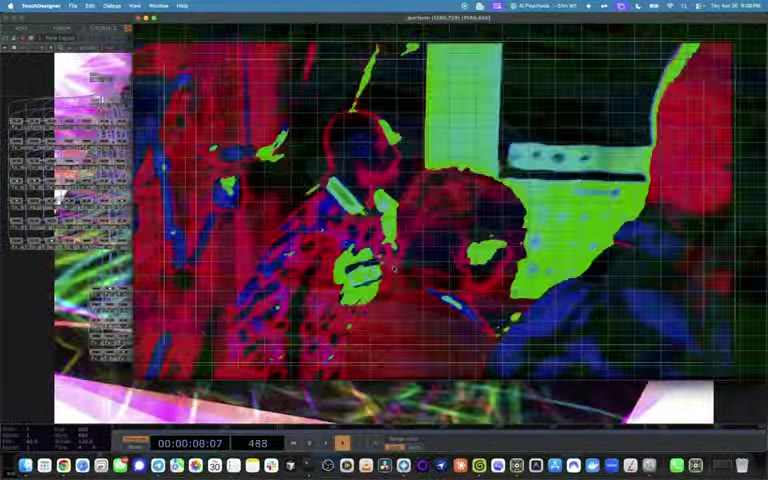
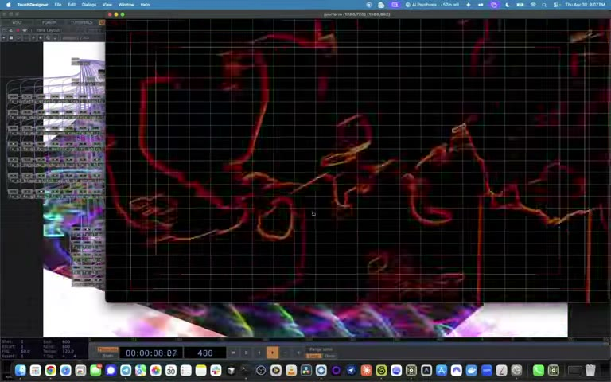
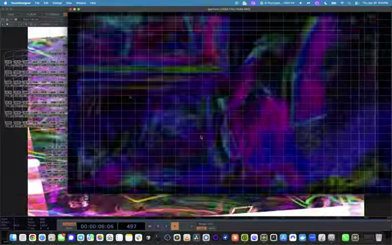

# YOUSUKE: Conceptual Audio Visual Responsive Art Piece Distilled by AI, Curated by Humans

> A conceptual audio visual responsive art piece. A bank of GLSL effects,
> 3-layer additive compositing, and 7 real-time audio parameters produce a
> practically infinite state space. The piece walked into the AI Psychosis
> Summit NYC with 43 effects (~6.4 × 10³⁷ visual states) and grew **live,
> mid performance** to 133 effects (~2.0 × 10³⁹ states), the AI generating
> new filters for an extra hour while the artist DJ'd. Distilled by AI:
> Claude Opus 4.7 (Anthropic) generated the effects and Hermes (Nous
> Research) built the TouchDesigner network via MCP. Curated, corrected,
> and steered throughout by a human.
>
> *"The AI caught patterns I couldn't see, and I caught intent it couldn't
> feel. Neither of us could have made this alone."*
>
> **Why this piece exists: [ARTIST_STATEMENT.md](ARTIST_STATEMENT.md)**



*Live at the AI Psychosis Summit, 93 Canal Street NYC, April 30, 2026.
[Watch the performance.](https://www.youtube.com/watch?v=6kgnXu5pmf4)*

---

## Table of Contents

1. [Introduction](#1-introduction)
2. [Methodology](#2-methodology)
3. [System Architecture](#3-system-architecture)
4. [The Pipeline in Detail](#4-the-pipeline-in-detail)
5. [Audio Reactivity & Real-Time Operation](#5-audio-reactivity--real-time-operation)
6. [The Combinatorial Explosion](#6-the-combinatorial-explosion)
7. [Effects Catalog](#7-effects-catalog)
8. [Usage](#8-usage)
9. [Repository Structure](#9-repository-structure)
10. [Technical Requirements](#10-technical-requirements)
11. [Acknowledgments](#11-acknowledgments)
12. [License](#12-license)

---

## 1. Introduction

Yousuke is a conceptual audio visual responsive art piece conceived for the
**AI Psychosis Summit NYC**, where it was performed live on April 30, 2026.
It takes live audio input (microphone, DJ interface, or pre-recorded audio
file), performs real-time spectral feature extraction, and drives a bank of
GLSL pixel shaders that transform a camera feed into beat-synchronized
visual output.

The effect bank itself was built in generations, each correcting the last.
The first batch of AI-generated filters missed the aesthetic entirely.
A second iteration, guided by human-selected screenshots of the source
material, produced the 43-effect bank the piece brought to the summit
(~6.4 × 10³⁷ possible visual states; roughly 2.5 quintillion universe
lifetimes to exhaust at 60 fps). Then, about an hour before showtime, a
third generation began: 90 derivative effects spun off from the 43, with
the AI agents generating and wiring filters **while the performance was
underway**. The artist DJ'd as the computer worked for an extra hour, and
the state space expanded live to **133 wired effects** and ~2.0 × 10³⁹
states before the night ended.

### The Performance

The piece ran live at the summit: a camera pointed at the crowd in a
shuttered Chinatown bank, projected back at the room through the effect
bank ([Reason's dispatch from the night](https://reason.com/2026/05/06/a-dispatch-from-the-ai-psychosis-summit/),
[Business Insider's coverage](https://www.businessinsider.com/inside-nyc-ai-psychosis-summit-party-anthropic-claude-code-2026-5)):

| | |
|---|---|
|  |  |

- **Performance night screen capture** (Apr 30, 2026): [youtube.com/watch?v=6kgnXu5pmf4](https://www.youtube.com/watch?v=6kgnXu5pmf4)
- **Setup day, earlier iteration** (Apr 28, 2026): [youtube.com/watch?v=exUo5tm1M8k](https://www.youtube.com/watch?v=exUo5tm1M8k)
- **The summit**: [psychosis.nyc](https://psychosis.nyc/)

The system is delivered on two parallel paths:

- **TouchDesigner** (`.toe`): GPU-accelerated, presentation-grade, built
  programmatically via AI agents through the twozero MCP bridge
- **Python standalone** (`standalone/visuals.py`): runs on any laptop with
  a webcam and microphone, no TouchDesigner required

### The Inspiration

The visual language is derived from
**¥ØU$UK€ ¥UK1MAT$U | Boiler Room Tokyo x Super Dommune, visuals by
Bridge**: a 1:33:30 live performance whose visual identity was analyzed,
distilled, and extended through the pipeline described in this document.

> "Zone in: it's Osaka spirit force YOUSUKE YUKIMATSU, live from
> Dommune in Tokyo."

That set is, to the artist, one of Yukimatsu's best performances paired
with his best visuals, and the Yukimatsu x Bridge collaboration happened
exactly once, for that hour and a half, and never again. This piece exists
because that collaboration will likely never repeat. Rather than wait for
it, the artist took matters into his own hands and built a system that
extends its visual identity toward infinity. It was not Yukimatsu's story
alone that sparked the piece. It was the visual identity fused with the
musical performance, a pairing that can no longer be, stretched here into
a state space larger than the age of the universe.

The project also began from a place of inability: the artist did not know
how to operate TouchDesigner. The **Nous Research Hermes agent** and the
**twozero MCP bridge** made the software reachable. AI agents as the
hands, the human as the eye.

### The Central Research Question

**Can AI agents extract a human artist's live visual identity from video,
reproduce it in TouchDesigner, and generate novel extensions?**

The answer, documented in [PROCESS.md](docs/PROCESS.md), is yes, with
significant caveats about the indispensable role of human curation in the
loop. Algorithmic clustering alone produced a statistically accurate but
aesthetically misleading visual vocabulary. Human frame selection,
combined with AI analysis, produced dramatically better results than
either approach alone.

---

## 2. Methodology

The system was built through a five-phase pipeline, with the last phase
running live during the performance itself:

### Phase 1: Visual Identity Extraction via Computer Vision

`pipeline/analyze_video.py` samples the source video at regular intervals, extracts
a 19-float feature vector per frame (5 dominant colors via k-means on 64x64
downsampled frames, edge density, brightness, saturation mean, color
variance), clusters 1,871 sampled frames into 40 canonical style clusters
using k-means, then deduplicates into 7 consolidated visual techniques.

**The canonical correction:** This analysis revealed that 7 of 8
hand-guessed effects were aesthetically wrong. The actual visual grammar is
chiaroscuro-bloom-chromatic with soft, indistinct light-boundary edges, not
sharp TRON-cyberpunk contours. What appeared to be "edge detection" in the
source material was actually high-contrast luminance boundaries rendered
through heavy bloom and chromatic aberration.

### Phase 2: Human-Guided Frame Selection

The operator took screenshots of specific frames from the set that captured
the desired aesthetic intent. These screenshots were fed directly to Claude
Opus 4.7 as vision input via the Hermes harness. This proved to dramatically
improve output quality compared to relying solely on algorithmic clustering.

The insight: the human eye catches aesthetic intent (mood, atmosphere,
emotional weight) that k-means misses. The AI catches statistical patterns
(color distributions, edge frequencies, spatial correlations) that the
human misses. Together they produce a visual vocabulary that neither could
achieve alone.

### Phase 3: AI-Powered Effect Generation

`pipeline/generate_effect.py` uses Claude Opus 4.7 with vision input to generate
GLSL pixel shaders and Python effect plugins. Each generated effect passes
a 4-step validation pipeline (syntax check, required exports, test run,
shape match) with a self-correcting retry loop that feeds errors back to the
model.

**The extension strategy:** First, 21 original effects were generated that
faithfully reproduce the source material's visual identity. Then a second
pass instructed the harness to produce 21 additional "mutation" effects
inspired by the initial set: same visual DNA, new expressions. This doubled
the visual vocabulary while maintaining aesthetic coherence. A third pass,
90 derivative effects spun off from the full bank, was launched roughly an
hour before the summit performance and completed while it was underway
(see [Phase 5](#phase-5-live-expansion-during-the-performance)).

### Phase 4: AI-Agent-Driven TouchDesigner Construction

The Nous Research Hermes Agent, equipped with the TouchDesigner skill and
36 native tools, constructed the complete TD network through the twozero MCP
bridge (JSON-RPC on `localhost:40404`). The initial 43 GLSL shaders, the 3-layer
compositing chain, frequency-band prominence mapping, and aggressive
auto-rotation logic were built programmatically without manual TD interaction.

### Phase 5: Live Expansion During the Performance

Roughly one hour before showtime at the AI Psychosis Summit, a final
generation pass was launched: 90 derivative effects (`fx_g3_*`) spun off
from the 43-effect bank. The generation and wiring ran for about an extra
hour, **while the performance was underway**. The artist DJ'd. The
computer built filters. The auto-rotate system, which counts connected
router inputs at runtime, absorbed each new effect into the rotation the
moment it was wired. The piece the audience saw at the start of the night
and the piece they saw at the end were not the same instrument.

---

## 3. System Architecture

### High-Level Signal Flow

```
 AUDIO INPUT                    VIDEO INPUT
 ┌──────────────┐               ┌──────────────────┐
 │ Live Mic /   │               │ Webcam / OBS /   │
 │ DJ Interface │               │ iPhone USB /     │
 │ Audio File   │               │ Video File       │
 └──────┬───────┘               └────────┬─────────┘
        │                                │
        ▼                                ▼
 ┌──────────────────┐           ┌──────────────────┐
 │ FEATURE EXTRACT  │           │  cam_in (1280x720)│
 │ RMS, sub_bass,   │           └────────┬─────────┘
 │ bass, mids,      │                    │
 │ highs, beat,     │                    │
 │ onset            │                    │
 └──────┬───────────┘                    │
        │         ┌──────────────────────┘
        │         │
        ▼         ▼
 ┌─────────────────────────────────────────────────┐
 │             EFFECT ENGINE (133 GLSL shaders)     │
 │                                                  │
 │  Each shader receives: camera texture + uAudio   │
 │  uAudio  = (time, rms, bass, sub_bass)           │
 │  uAudio2 = (sub_bass, mids, highs, beat)         │
 └──────────────────────┬──────────────────────────┘
                        │
                        ▼
 ┌─────────────────────────────────────────────────┐
 │           3-LAYER COMPOSITING                    │
 │                                                  │
 │  effect_router ──┐                               │
 │  layer2_router ──┼── blend_add1 ──┐              │
 │  layer3_router ──┘   blend_add2 ──┼── blend_level│
 │                                   │    → output  │
 │  (3 random effects composited)    │              │
 └─────────────────────────────────────────────────┘
                        │
                        ▼
                 ┌──────────────┐
                 │ main_output  │
                 │ (1280x720)   │
                 └──────────────┘
```

### TouchDesigner Signal Flow

The TD network uses a 3-layer compositing architecture where three
independent `switchTOP` routers (`effect_router`, `layer2_router`,
`layer3_router`) each select from the same bank of 133 effects. These are
blended additively through `blend_add1` and `blend_add2`, then passed
through `blend_level` for final output scaling. The auto-rotate system
randomly selects 3 different effects per switch event, so the output is
always a layered composite of three independent visual streams.

### Python Standalone Signal Flow

The Python engine (`standalone/visuals.py`) uses a plugin architecture:

1. **Plugin loader** scans `effects/`, `effects/ai_generated/`, and
   `effects/canonical/` for modules exporting `EFFECT_META` + `fx_function`
2. **AudioFeatures** extracts spectral bands from live mic or audio file
   via `sounddevice` + `librosa`
3. **Effect router** dispatches the current frame + audio features to the
   active effect function
4. **Render loop** composites the result and displays via OpenCV window

### Input Flexibility

- **Video**: any device the OS presents as a camera: MacBook webcam, OBS
  Virtual Camera, iPhone via USB
- **Audio**: live microphone / audio interface, or a pre-recorded audio
  file with beat-synchronized effect application
- **Offline rendering**: `tools/render_reel.py` renders effect reels
  headless, without a live camera or audio device

---

## 4. The Pipeline in Detail

### 4.1 Video Analysis & Canonical Style Extraction

```bash
python pipeline/analyze_video.py --interval 3 --clusters 40
```

The pipeline operates in 5 stages:

1. **Frame sampling**: Seeks to every N seconds via
   `cv2.CAP_PROP_POS_MSEC`, saves `(timestamp, frame)` pairs
2. **Feature extraction**: Per frame: 15 dominant color floats (k-means
   k=5 on 64x64 downsampled), edge density, brightness, saturation mean,
   color variance (19 floats total)
3. **K-means clustering**: `sklearn.cluster.KMeans` on
   `StandardScaler`-normalized feature matrix
4. **Representative selection**: Frame with minimum L2 distance to cluster
   centroid
5. **Catalog build**: JSON + JPEG saved to `reference/`

The analysis of the YOUSUKE YUKIMATSU set produced 40 raw clusters that
consolidated into 7 distinct visual techniques:

| # | Technique | Coverage | Key Characteristics |
|---|-----------|----------|---------------------|
| 1 | Chiaroscuro magenta bloom | ~45% | Crushed blacks, blown highlights, magenta/pink/white |
| 2 | Chiaroscuro cyan/cool bloom | ~12% | Same technique, cool palette (cyan/white/blue) |
| 3 | Crushed-black silhouette | ~15% | Extreme black crush, figure barely emerges |
| 4 | Hazy low-contrast dream | ~3% | Raised blacks, dusty rose, uniform fog |
| 5 | Dark atmospheric macro | ~4% | Shallow DoF, equipment close-ups, warm shadows |
| 6 | Pixel-sort radial shards | ~3% | Radial pixel extrusion, crystalline needles |
| 7 | Feedback echo tunnel | ~7% | Recursive frame compositing, hall of mirrors |

Full catalog: [reference/CANONICAL_CATALOG.md](reference/CANONICAL_CATALOG.md)

### 4.2 Human-in-the-Loop Frame Selection

The operator screenshots specific frames from the set that capture the
desired aesthetic. These screenshots are fed directly to Claude Opus 4.7
via the Hermes harness as vision input. The AI analyzes the frame's visual
properties (luminance distribution, color palette, edge characteristics,
bloom behavior) and generates TouchDesigner GLSL shaders that reproduce
the style.

This approach dramatically improved fidelity compared to relying solely on
algorithmic clustering. The human curates intent; the AI executes with
precision.

### 4.3 AI Effect Generation & Extension

```bash
# From a video frame (vision input)
python pipeline/generate_effect.py --from-frame reference/canonical_effects_frames/cluster_05.jpg --name "Plasma Web"

# From text description
python pipeline/generate_effect.py --describe "glitchy RGB channel separation with scan lines"

# Extend an existing effect
python pipeline/generate_effect.py --extend neon_contour --name "Kanji Storm"

# From canonical catalog entry
python pipeline/generate_effect.py --from-canonical reference/canonical_effects.json --id 7
```

Every generated effect passes 4 validation checks before being saved:

1. **Syntax**: `ast.parse()` catches malformed Python
2. **Required exports**: `EFFECT_META` dict + `fx_function` callable
3. **Test run**: `fx_function(np.zeros((480,640,3)), MockAF(), {})`
   must return `(480,640,3) uint8`
4. **Shape match**: Output shape must equal input shape

On validation failure, the error and prior code are fed back to the model
for up to 2 retries.

**The extension strategy:** 21 original effects were generated that
faithfully reproduce the source material's visual identity. A second pass
produced 21 additional "mutation" effects: same visual DNA, new
expressions. This is how the visual identity was extended beyond
reproduction into novel territory.

### 4.4 TouchDesigner Network Construction via AI Agents

The TD network was built entirely through AI agents:

- **Agent**: Nous Research Hermes Agent with TouchDesigner skill (36
  native tools)
- **Bridge**: twozero MCP bridge by 404.zero (JSON-RPC on
  `localhost:40404`)
- **Build scripts**:
  - `tools/td_build_effects.py`: 21 original GLSL pixel shaders
    (1,347 lines of shader code)
  - `tools/td_build_mutations.py`: 21 mutation GLSL variants
    (1,358 lines of shader code)
  - `tools/td_wire_all.py`: 3-router wiring topology
  - `tools/td_add_prominence.py`: Per-frequency-band dynamic opacity
  - `tools/td_update_rotation.py`: Aggressive random auto-rotation

Each GLSL shader follows a common architecture:

```glsl
uniform vec4 uAudio;   // (time, rms, bass, sub_bass)
uniform vec4 uAudio2;  // (sub_bass, mids, highs, beat)

#define iTime   uAudio.x
#define energy  uAudio.y
#define bass    uAudio.z
#define sub     uAudio.w
#define mids    uAudio2.y
#define highs   uAudio2.z
#define beat    uAudio2.w
```

Effects are structured as baseCOMPs with:
`inTOP (camera) -> glslTOP (pixel shader) -> levelTOP (prominence) -> outTOP`

---

## 5. Audio Reactivity & Real-Time Operation

### Feature Extraction

| Channel | Range | Frequency Band | Description |
|---------|-------|----------------|-------------|
| `rms` | 0-1 | Full spectrum | Overall energy level |
| `sub_bass` | 0-1 | 0-80 Hz | Sub-bass rumble |
| `bass` | 0-1 | 80-300 Hz | Kick drums, bass lines |
| `mids` | 0-1 | 300-3000 Hz | Vocals, leads, synths |
| `highs` | 0-1 | 3000 Hz+ | Hi-hats, cymbals, presence |
| `beat` | 0/1 | Trigger | Beat onset detection |
| `onset` | 0-1 | Transient | Transient energy envelope (Python standalone only) |

The TouchDesigner network exposes the first six channels. `onset` exists
only in the Python standalone, so the onset trigger in the TD auto-rotate
script stays dormant and switching runs on the timer and the beat counter.

### Prominence System

Effects are mapped to frequency bands for dynamic opacity:

| Band | Effect Indices | Behavior |
|------|---------------|----------|
| Bass | 0-13 | Opacity pulses with bass energy |
| Mids | 14-28 | Opacity pulses with mid energy |
| Highs | 29-42 | Opacity pulses with high-frequency energy |

All effects receive a beat flash overlay that brightens momentarily on
detected beats.

### Auto-Rotation

The auto-rotate system cycles effects with the following parameters:

- **Switch interval**: 1.5 seconds (time-based fallback)
- **Beat switch threshold**: 5 beats (music-driven switching)
- **Onset threshold**: 0.2 (transient energy gate)
- **Minimum onset time**: 0.8 seconds (debounce)
- **Selection**: `random.sample(range(N), 3)`, 3 different effects per
  switch event, one per compositing layer

---

## 6. The Combinatorial Explosion

### The Proof

The 3-layer additive compositing system produces a combinatorial state space
so vast it becomes practically infinite.

**Discrete combinations.** The auto-rotate system selects 3 effects via
`random.sample(range(N), 3)`, where N is counted live from the router's
connected inputs. Since additive compositing is commutative
(L1 + L2 + L3 = L3 + L1 + L2), the selection is unordered. As the piece
entered the summit (N = 43):

> C(43, 3) = 43! / (3! × 40!) = **12,341** unique effect combinations

**Continuous audio state.** Each of the 7 audio parameters (`rms`,
`sub_bass`, `bass`, `mids`, `highs`, `beat`, `onset`) varies continuously in
[0, 1]. At a conservative 16-bit discretization (65,536 levels per
parameter):

> 65,536⁷ ≈ **5.19 × 10³³** possible audio states

**Total instantaneous visual states:**

> 12,341 × 5.19 × 10³³ ≈ **6.4 × 10³⁷**

**Universe comparison.** The observable universe is ~13.8 billion years old.
At 60 fps, that is ~2.61 × 10¹⁹ frames. To exhaust every state once:

> 6.4 × 10³⁷ / 2.61 × 10¹⁹ ≈ **2.5 × 10¹⁸ universe lifetimes**

That is roughly **2.5 quintillion ages of the universe**.

**The full network.** By the end of the performance the live Gen3
expansion had brought the wired effect count to 133, and the same math
scales accordingly:

> C(133, 3) = **383,306** unique effect combinations
> 383,306 × 5.19 × 10³³ ≈ **2.0 × 10³⁹** instantaneous visual states
> ≈ **7.6 × 10¹⁹ universe lifetimes** to exhaust at 60 fps

The auto-rotate script counts connected router inputs at runtime, so the
state space grows automatically every time a new effect is wired in. That
is exactly what happened on stage: the universe of possible frames expanded
by two orders of magnitude while the audience was inside it.

### What the Conservative Estimate Ignores

The 6.4 × 10³⁷ figure is a lower bound. It excludes:

- **`iTime` (temporal evolution)**: Every shader uses `iTime` as an
  animation driver. Even with the same 3 effects and the same 7 audio
  values, the visual output changes continuously over time.
- **Feedback buffers**: Effects like Feedback Spiral Zoom and Glitch
  Feedback carry temporal state from previous frames.
- **Chaos Engine transforms**: The aggressive variant uses 150ms minimum
  gap, producing ~10⁹⁵ states when temporal evolution is included.

### Switching Behavior

Effect switching is not on a fixed timer. Three independent triggers race,
and whichever fires first causes a switch:

| Trigger | Condition | Behavior |
|---------|-----------|----------|
| Timer | 1.5 seconds elapsed | Time-based fallback |
| Beat count | 5 beats accumulated | Music-driven switching |
| Onset energy | onset > 0.2 | Transient gate (0.8s debounce) |

The Chaos Engine variant is more aggressive, with a 150ms minimum gap
between switches.

### Why This Matters

Every frame of Yousuke output has almost certainly never existed before and
will never exist again. The system does not cycle through a playlist of
looks. It occupies a state space so large that exhaustive traversal would
require quintillions of universe lifetimes. This was never specified as a
design goal. It is an emergent property of three architectural decisions:
a large effect bank, 3-layer compositing, and 7 continuous audio
parameters. The AI agents that built this system created a combinatorial
explosion they cannot comprehend.

### A Note on Documentation Integrity

In July 2026, this repository was audited end to end by a more powerful
model, **Claude Fable 5**, which opened the production `.toe` in
TouchDesigner, drove the twozero MCP bridge against the live network, and
compared what actually runs to what these documents claimed. It found
inconsistencies: the docs said 43 effects while the production network
carries 133; the TD audio chain exposes 6 channels, not 7 (the `onset`
trigger in the auto-rotate script is dormant, fails safely, and has never
fired); and several counts and paths had drifted as the piece evolved.

We intentionally chose to leave these in the code but correct them here in
the README, to reflect the exact piece that was exhibited and the changes
made on the go at the summit. The dormant onset branch, the
version-numbered `.toe` files, the drift between what was documented and
what was running: that *is* the piece. A system distilled by AI agents,
audited by a later AI agent, that grew past its own documentation. The
inconsistencies are the fossil record of a live artwork, not defects to be
erased.

---

## 7. Effects Catalog

### Summary

| Category | Count | Source |
|----------|-------|--------|
| Original GLSL shaders | 21 | AI-generated from source video analysis |
| Mutation GLSL shaders | 21 | AI-generated variations of originals |
| Canon shards | 1 | Vision-verified canonical effect |
| Gen3 GLSL shaders | 90 | Derivatives generated live during the performance |
| Hand-coded Python effects | 8 | Initial prototypes |
| AI-generated Python effects | 21 | Claude-generated plugins |
| Canonical Python effects | 2 | Cluster-derived plugins |

The 43 core GLSL effects (21 + 21 + 1) were the bank the piece brought to
the summit on April 30, 2026. The 90 Gen3 effects are derivatives of those
43, generated via `tools/td_build_gen3.py` starting roughly an hour before
showtime and wired in **while the performance was underway**, bringing the
production network to 133 wired effects per router before the night ended.
(The resulting `.toe` was committed to this repository on May 13, 2026.)

### Original GLSL Shaders (21)

| # | Name | Description |
|---|------|-------------|
| 0 | Confetti Particle Storm | Pink body tint + starfield + confetti particles |
| 1 | Thermal Posterize | 3-color thermal map + chromatic aberration |
| 2 | Fire Face Scanlines | FBM fire noise on face region + metallic scanlines |
| 3 | Echo Clone Trail | Multi-offset echo copies with progressive blur |
| 4 | Rainbow Echo Spiral | Hue-shifted echo copies in spiral arrangement |
| 5 | Liquify Wave Body | Sinusoidal UV displacement driven by bass |
| 6 | Pixel Mosaic Glitch | Block-based pixelation with random color shift |
| 7 | Datamosh Freeze | Temporal freeze + color smear glitch |
| 8 | RGB Channel Explosion | Per-channel radial displacement |
| 9 | Mirror Kaleidoscope | 8-fold symmetry with rotation |
| 10 | Plasma Tentacles | Procedural plasma overlay with tentacle forms |
| 11 | Strobe Flash Invert | Beat-synced luminance inversion strobe |
| 12 | Body Pixelate Cascade | Progressive body-region pixelation |
| 13 | Glitch Horizon Tear | Horizontal tear displacement with color bleed |
| 14 | Radial Zoom Tunnel | Radial zoom blur into frame center |
| 15 | Neon Skeleton Wire | Edge-detected wireframe with neon glow |
| 16 | Color Solarize Pulse | Solarization curve modulated by audio |
| 17 | Triangle Mesh Shatter | Triangulated mesh with per-face displacement |
| 18 | Feedback Spiral Zoom | Recursive zoom with spiral rotation |
| 19 | Binary Rain Matrix | Falling binary digit columns |
| 20 | Chromatic Body Double | Dual chromatic-aberrated body silhouettes |

### Mutation GLSL Shaders (21)

| # | Name | Parent Effect |
|---|------|---------------|
| 21 | Acid Confetti | Confetti Particle Storm |
| 22 | X-Ray Thermal | Thermal Posterize |
| 23 | Ice Scanlines | Fire Face Scanlines |
| 24 | Echo Kaleidoscope | Echo Clone Trail |
| 25 | Rainbow Shatter | Rainbow Echo Spiral |
| 26 | Liquify Vortex | Liquify Wave Body |
| 27 | Pixel Rain | Pixel Mosaic Glitch |
| 28 | Datamosh Strobe | Datamosh Freeze |
| 29 | RGB Spiral | RGB Channel Explosion |
| 30 | Hyper Kaleidoscope | Mirror Kaleidoscope |
| 31 | Plasma Web | Plasma Tentacles |
| 32 | Strobe Posterize | Strobe Flash Invert |
| 33 | Cascade Mirror | Body Pixelate Cascade |
| 34 | Glitch Feedback | Glitch Horizon Tear |
| 35 | Radial Neon | Radial Zoom Tunnel |
| 36 | Skeleton Fire | Neon Skeleton Wire |
| 37 | Negative Solarize | Color Solarize Pulse |
| 38 | Voronoi Feedback | Triangle Mesh Shatter |
| 39 | Double Spiral | Feedback Spiral Zoom |
| 40 | Kanji Matrix | Binary Rain Matrix |
| 41 | Chromatic Prism | Chromatic Body Double |

### Additional Effect: Canon Shards

Index 42 in the TD router. A vision-verified canonical effect derived
from cluster analysis of the source video.

### Gen3 Shaders (90, generated live at the summit)

Generated in the final hour before and during the April 30 performance:
a third generation focused on body-contour and
silhouette treatments (33 `body_*` effects: neon outlines, laser scans,
holograms, x-ray/thermal/comic contours, kaleidoscope and starfield
silhouettes) plus hybrid palette families (`arctic_*`, `blood_*`,
`cyber_*`, `ocean_*`, `pastel_*`, `fire_*`) and intensified variants
(`extreme_*`, `hyper_*`, `mega_*`, `turbo_*`, `ultra_*`) recombining the
original effect DNA: datamosh, kaleido, plasma, solarize, strobe, echo,
shatter, and matrix elements. All 90 live at router indices 43–132.

Full effect reference with audio mappings, generation methods, and
performance data: [docs/EFFECTS_CATALOG.md](docs/EFFECTS_CATALOG.md)

---

## 8. Usage

### Quick Start

```bash
# Clone the repository
git clone https://github.com/ConejoCapital/Yousuke.git
cd Yousuke

# Set up the Python environment (creates .venv and installs everything)
bash scripts/setup.sh

# Run the Python standalone (webcam + mic)
.venv/bin/python standalone/visuals.py --mode webcam --audio mic
```

### Python Standalone

```bash
# Webcam + live microphone
.venv/bin/python standalone/visuals.py --mode webcam --audio mic

# Drive the visuals with a pre-recorded audio file instead of the mic
.venv/bin/python standalone/visuals.py --mode webcam --audio reference/audio.mp3

# Start locked on a specific effect, or hide the HUD
.venv/bin/python standalone/visuals.py --effect 3 --no-hud
```

**Keyboard controls:**

| Key | Action |
|-----|--------|
| `1-9` | Lock to a specific effect |
| `+` / `=` | Cycle forward through all effects |
| `0` | Return to auto-rotate |
| `Space` | Pause / resume |
| `L` | Load a new audio file at runtime |
| `Q` / `Esc` | Quit |

### TouchDesigner Network

Requires TouchDesigner 2025.32460+ (free license from
[derivative.ca](https://derivative.ca/download)):

```bash
# Launch via script
bash scripts/launch_summit.sh --mode td

# Or open directly
open touchdesigner/AIPSummitYousuke.36.toe
```

In TouchDesigner:
1. Locate `main_output` (windowCOMP)
2. Right-click, select **Open as Window**
3. Move to projector/secondary monitor

Or via TD Python console:
```python
op('/project1/main_output').par.winopen.pulse()
```

### Driving the Visuals with a Recorded Track

Point `--audio` at any audio file and the effects sync to its beats
instead of the live microphone:

```bash
.venv/bin/python standalone/visuals.py --mode webcam \
    --audio reference/audio.mp3
```

You can also press `L` while the engine is running to load a different
audio file without restarting.

### Generating New Effects

```bash
# Requires ANTHROPIC_API_KEY
export ANTHROPIC_API_KEY=sk-ant-api03-...

# From a video frame (Claude vision input)
python pipeline/generate_effect.py --from-frame reference/canonical_effects_frames/cluster_05.jpg \
    --name "Plasma Web"

# From text description
python pipeline/generate_effect.py --describe "geometric kaleidoscope that pulses on bass"

# Extend an existing effect
python pipeline/generate_effect.py --extend neon_contour --name "Kanji Storm"

# From canonical catalog
python pipeline/generate_effect.py --from-canonical reference/canonical_effects.json --id 7
```

Generated effects are saved to `effects/ai_generated/` and auto-discovered
by the plugin loader at next startup.

### Analyzing Source Video

```bash
# Default: 10s interval, 20 clusters
python pipeline/analyze_video.py

# High-resolution scan
python pipeline/analyze_video.py --interval 5 --clusters 30

# Custom paths
python pipeline/analyze_video.py --video /path/to/set.mp4 --output /path/to/effects.json
```

---

## 9. Repository Structure

```
Yousuke/
├── README.md                          # This document
├── ARTIST_STATEMENT.md                # Why this piece exists
├── LICENSE                            # MIT
├── CLAUDE.md                          # Project context for AI agents
├── pytest.ini                         # Test configuration
│
├── touchdesigner/
│   ├── AIPSummitYousuke.36.toe        # The piece: production TD network
│   └── README_FOR_HERMES.md           # Hermes TD build instructions
│
├── standalone/
│   ├── visuals.py                     # Python standalone visual engine
│   └── requirements.txt               # Python dependencies
│
├── pipeline/
│   ├── analyze_video.py               # Video analysis + k-means clustering
│   ├── generate_effect.py             # AI effect generation (Claude API)
│   └── download_video.py              # Reference video downloader
│
├── media/                             # Performance stills (Apr 30, 2026)
│
├── effects/
│   ├── __init__.py                    # Plugin loader
│   ├── _utils.py                      # Shared utilities
│   ├── neon_contour.py                # Hand-coded effect
│   ├── particle_confetti.py           #   "
│   ├── voxel_explosion.py             #   "
│   ├── volumetric_rings.py            #   "
│   ├── shard_burst.py                 #   " (optimized: 42ms -> 1.4ms)
│   ├── gold_particle_rain.py          #   "
│   ├── film_grain.py                  #   " (optimized: 35ms -> 7.8ms)
│   ├── kanji_float.py                 #   "
│   ├── ai_generated/                  # 21 AI-generated Python effects
│   └── canonical/                     # 2 vision-verified canonical effects
│
├── tools/
│   ├── README.md                      # Script reference & build order
│   ├── td_build_effects.py            # Build 21 original GLSL effects via MCP
│   ├── td_build_mutations.py          # Build 21 mutation GLSL effects via MCP
│   ├── td_build_chaos.py              # Build Chaos Engine variant
│   ├── td_build_contour.py            # Build contour effect via MCP
│   ├── td_build_gen3.py               # Build Gen3 effects via MCP
│   ├── td_wire_all.py                 # Wire all effects to 3-router topology
│   ├── td_wire_effects.py             # Wire individual effects
│   ├── td_wire_contour.py             # Wire contour effect
│   ├── td_wire_everything.py          # Wire complete network
│   ├── td_add_prominence.py           # Insert audio-driven levelTOPs
│   ├── td_add_web_input.py            # Add web input sources
│   ├── td_update_rotation.py          # Aggressive random 3-layer auto-rotate
│   ├── td_fix_rotation.py             # Fix rotation parameters
│   ├── td_mcp.py                      # Minimal MCP bridge helper
│   ├── chaos_engine_script.py         # Chaos Engine runtime script
│   ├── render_reel.py                 # Headless reel renderer
│   ├── live_showcase.py               # Fullscreen live showcase mode
│   ├── preview_canonical.py           # Canonical effects preview
│   ├── preview_in_terminal.sh         # Terminal preview helper
│   └── test_canonical.py              # Canonical effect tests
│
├── reference/
│   ├── CANONICAL_CATALOG.md           # Vision-verified canonical catalog
│   ├── canonical_effects.json         # Machine-generated effect signatures
│   ├── canonical_effects_frames/      # Representative cluster frames (40)
│   └── generation_plan.json           # Effect generation plan
│
├── tests/
│   ├── conftest.py                    # Shared fixtures
│   ├── test_smoke.py                  # 12 smoke tests
│   ├── test_audio_features.py         # 12 audio extraction tests
│   ├── test_plugin_loader.py          # 7 plugin loader tests
│   ├── test_effects_render.py         # 155 effect rendering tests
│   ├── test_perf.py                   # 32 performance tests
│   ├── test_analyze_video.py          # 7 video analysis tests
│   └── test_generate_effect.py        # 9 generation tests
│
├── scripts/
│   ├── setup.sh                       # Environment setup
│   └── launch_summit.sh               # One-command summit launch
│
└── docs/
    ├── ARCHITECTURE.md                # Technical system architecture
    ├── PROCESS.md                     # Narrative of the AI-driven build
    ├── CONTRIBUTING.md                # How to extend the system
    ├── EFFECTS_CATALOG.md             # Complete effects reference
    ├── PRODUCT_DOC.md                 # Original product specification (archived)
    ├── SUMMIT_README.md               # Summit-day operational guide (archived)
    ├── HERMES_PROMPT.md               # Hermes session kickoff prompt (archived)
    ├── PHASE_B_REPORT.md              # Phase B test report (historical)
    └── PHASE_D_PLAN.md                # TouchDesigner build plan (archived)
```

---

## 10. Technical Requirements

### Python Environment

- **Python** 3.11+
- **Core dependencies**: `opencv-python`, `numpy`, `sounddevice`, `librosa`
- **Optional**: `mediapipe` (body segmentation), `Pillow` (kanji effect),
  `scikit-learn` (video analysis)
- **For AI generation**: `anthropic` (requires `ANTHROPIC_API_KEY`)
- **For testing**: `pytest` (installed by the requirements file)

```bash
# Setup via script (creates .venv, installs everything)
bash scripts/setup.sh

# Or manually
python3 -m venv .venv
.venv/bin/python -m pip install -r standalone/requirements.txt
```

### TouchDesigner (Optional)

- **TouchDesigner** 2025.32460+ (free non-commercial license)
- Download from [derivative.ca](https://derivative.ca/download)
- **twozero MCP bridge** by 404.zero: required only for programmatic
  network construction, not for running the finished `.toe`

### For AI-Agent-Driven Construction

- **Hermes Agent** by Nous Research with TouchDesigner skill
- **twozero MCP bridge**: JSON-RPC server on `localhost:40404`
- Both required only for rebuilding/extending the TD network, not for
  running the finished system

---

## 11. Acknowledgments

Built by **Mauricio "Bunny" Trujillo**
([@ConejoCapital](https://x.com/ConejoCapital)), cofounder of **Tektonic
Company** ([@TektonicCompany](https://x.com/TektonicCompany)): "We build
intelligent systems and onchain infrastructure for teams pushing the
frontier."

Special thanks to **SHL0MS** ([@SHL0MS](https://x.com/SHL0MS)).

Special thanks to **Nous Research**
([@NousResearch](https://x.com/NousResearch)) for the **Hermes Agent** and
TouchDesigner skill that made AI-driven TD construction possible.

Inspired by **YOUSUKE YUKIMATSU's Boiler Room Tokyo x Super Dommune** set
(visuals by Bridge).

Powered by **Claude Opus 4.7** (Anthropic) for AI effect generation.

**twozero MCP bridge** by 404.zero and setupdesign.

---

## 12. License

[MIT](LICENSE)

Copyright (c) 2026 Mauricio "Bunny" Trujillo / Tektonic Company
